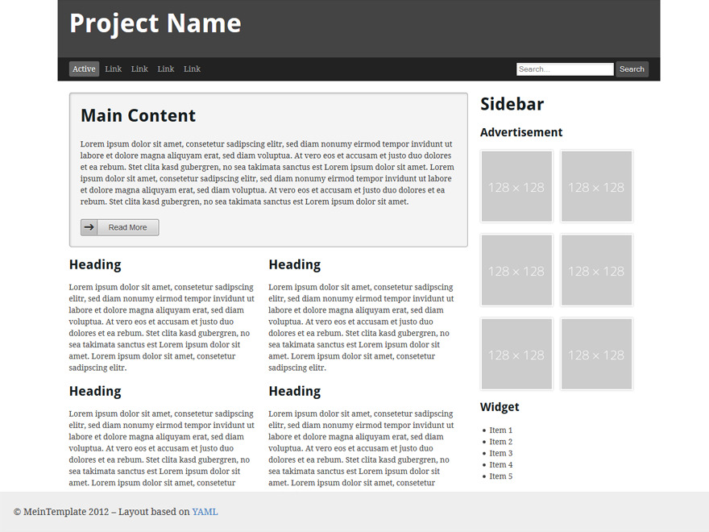

# About 
Throughout the Content Management System (CMS) course we acquired practical skills in creating WordPress themes.
During this class, we developed an example theme using YAML4, which resembles the design showcased below.

> To access the complete code for this theme, navigate to the [course_material -> demo_theme](https://github.com/Fahim-Ahmad/intoCODE/tree/main/Content%20Management%20System/course_material/demo_theme) folder.

# Final project

## requirements

## features

## final output

