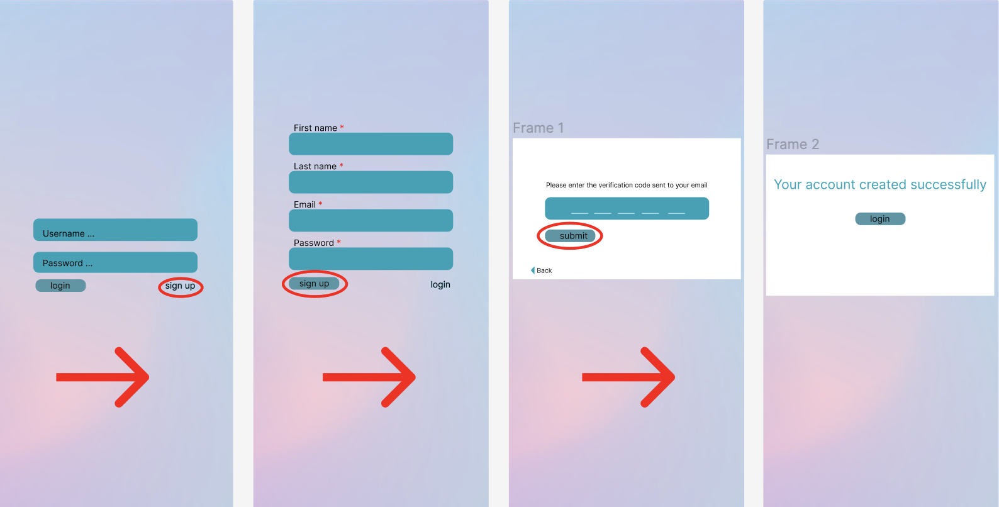

# Main Puspose:
Designing an app to enable individuals to conveniently interact with different institutions and government offices. By incorporating a dynamic interface, users will be able to access contact information, schedule appointments, and submit documents effortlessly. By providing a comprehensive solution within a centralized platform, users will be able to streamline their interactions with different institutions.

## Key Features:

1. User Authentication:
   - To ensure secure access, every user will be required to create an account and log in. This will guarantee the privacy and security of the data.

2. Dynamic Interface:
   - The app will feature a dynamic interface that adapts to the user's selection. For instance:
     - When users choose a list of universities, they will be presented with the <u>contact information and addresses</u> of the selected university.
     - When users select hospitals, they will have access to <u>contact details, addresses</u>, as well as the option to <u>schedule appointments</u>.
     - Similarly, when users choose government offices, they will be able to view <u>contact information, addresses</u>, <u>schedule appointments</u>, and conveniently <u>submit their documents</u>.

I have designed a sample app featuring the aforementioned criteria using [Figma](https://www.figma.com/). To explore the detailed design and interact with the prototype, you can access it through the following links:

- Figma Design: [https://www.figma.com/design](https://www.figma.com/file/kNoSetowFGLUG1IhuzQI3k/intoCODE-(UI%2FUX)?type=design&node-id=0%3A1&mode=design&t=f0o3fgOYAJjRfkIO-1)
- Prototype: [https://www.figma.com/prototype](https://www.figma.com/proto/kNoSetowFGLUG1IhuzQI3k/intoCODE-(UI%2FUX)?type=design&node-id=1-3&t=FL7W5nJ3VldDmup8-1&scaling=scale-down&page-id=0%3A1&starting-point-node-id=1%3A3&mode=design)

## Detailed Features:

1. User Account Creation:
   - Upon downloading the app, users will be able to create an account by providing necessary information, including an email address for receiving a confirmation code. Once the code is entered correctly, users will receive a confirmation notification on the screen, indicating that their account has been successfully created.

2. Login and Navigation:
   - After creating an account, users can log in using their pre-defined username (email address) and password. Once logged in, they will be presented with a list of different items to select from, enabling them to explore further details.

   

3. Viewing Details:
   - Upon selecting a specific item, such as a government office, users will be presented with a list of different offices. They can then view the details of a particular office, including its address, contact number, email, etc. Additionally, users will have the option to make appointments or send documents.

4. Document Submission:
   - When users choose to send a document, they will be directed to a new page where they can select the desired document to upload and include a brief description. Upon successfully sending the document, users will receive an on-screen notification confirming its successful submission.

5. Appointment Scheduling:
   - If users opt to make an appointment, they will be directed to a dedicated page where they can select a preferred date and provide a short description of the appointment's purpose.

6. Navigation and Accessibility:
   - Throughout the app, users will have access to a "Home" and "Logout" option, allowing them to navigate back to the main menu or log out to the login page, respectively.
   
   

   - An arrow icon &#9664; will be available on any page to enable users to go back to the previous page, while a forward arrow icon &#9654;
 will facilitate navigation to the next page.

   

