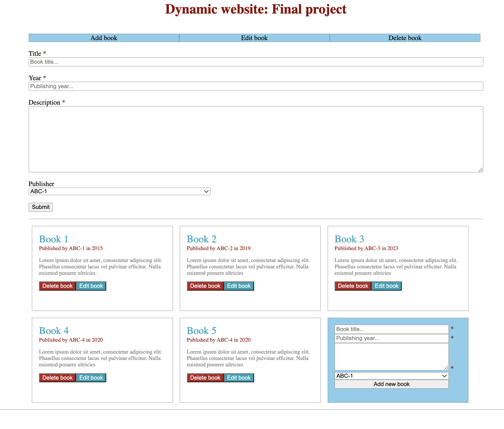

# Book Management Web Application

## About the final project

The main objective of this project is to create a web application for managing books.
It features the following functionalities:

* Adding a new book to the database
* Modifying details of an existing book
* Removing a book from the database


I used PHP for server-side logic and CSS for styling the appearance of the application.
The final outtput looks as below.



## SQL codes for creating tables and inserting some test data

### creating tables
```sql

CREATE TABLE IF NOT EXISTS publishers (
    publisher_id int(11) NOT NULL AUTO_INCREMENT,
    title varchar(50) NOT NULL,
    PRIMARY KEY (publisher_id)
);

```

```sql

CREATE TABLE IF NOT EXISTS books (
    id int(11) NOT NULL AUTO_INCREMENT,
    title varchar(50) NOT NULL,
    description varchar(150) NOT NULL,
    publishing_year int(4) NOT NULL,
    publisher_id int(11) NOT NULL,
    PRIMARY KEY (id),
    FOREIGN KEY (publisher_id) REFERENCES publishers (publisher_id)
);

```

### inserting test data

```sql

INSERT INTO publishers(title)
            VALUE("ABC-1"),
                ("ABC-2"),
                ("ABC-3"),
                ("ABC-4"),
                ("ABC-5");

```


```sql

INSERT INTO books(title, description, publishing_year, publisher_id)
            VALUE("Book 1", "Lorem ipsum dolor sit amet, consectetur adipiscing elit. Phasellus consectetur lacus vel pulvinar efficitur. Nulla euismod posuere ultricies", 2015, 1),
                ("Book 2", "Lorem ipsum dolor sit amet, consectetur adipiscing elit. Phasellus consectetur lacus vel pulvinar efficitur. Nulla euismod posuere ultricies", 2019, 2),
                ("Book 3", "Lorem ipsum dolor sit amet, consectetur adipiscing elit. Phasellus consectetur lacus vel pulvinar efficitur. Nulla euismod posuere ultricies", 2023, 3),
                ("Book 4", "Lorem ipsum dolor sit amet, consectetur adipiscing elit. Phasellus consectetur lacus vel pulvinar efficitur. Nulla euismod posuere ultricies", 2020, 4),
                ("Book 5", "Lorem ipsum dolor sit amet, consectetur adipiscing elit. Phasellus consectetur lacus vel pulvinar efficitur. Nulla euismod posuere ultricies", 2020, 4);

```


