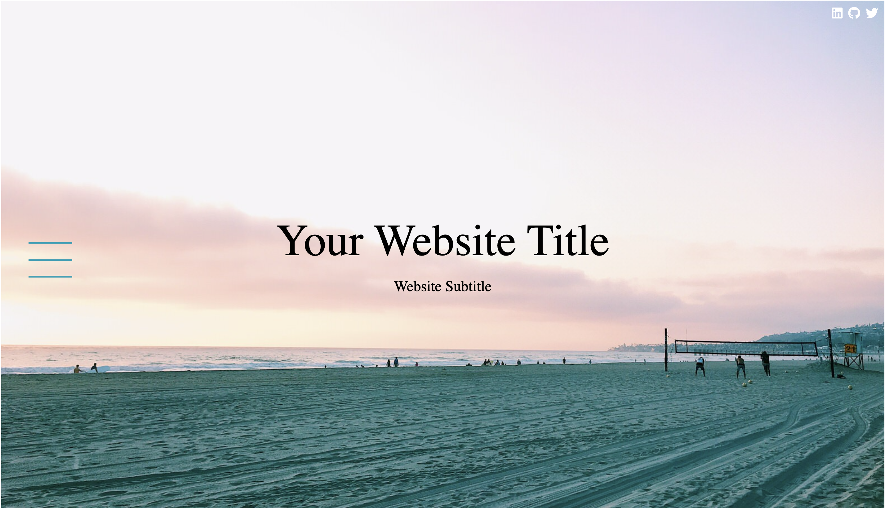
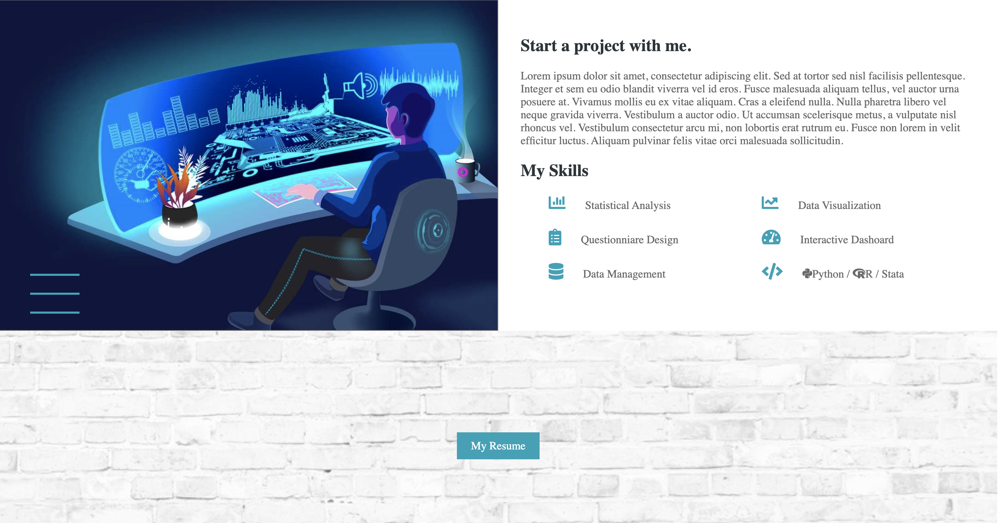
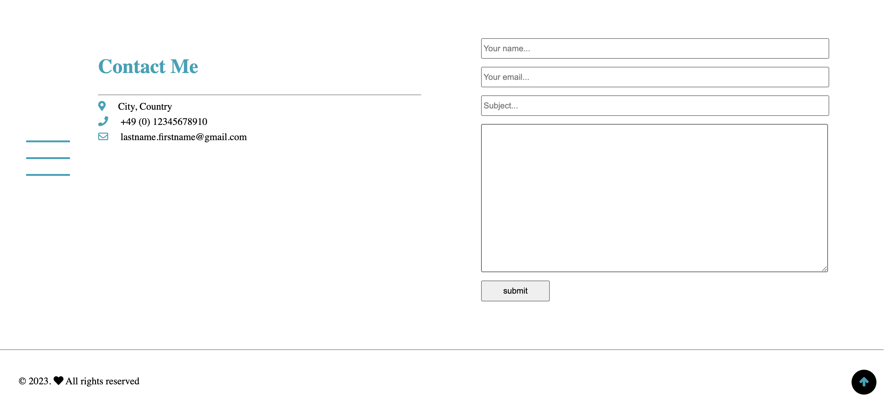

# About
I developed this website as a showcase of my HTML and CSS skills, which I developed during the 'Static Website' class.
While the its primary purpose is to demonstrate my abilities, anyone is welcome to use the template I've created.

## Features

- Responsive designs that adjust to various screen sizes and devices
- A landing page (visible only on computer screens)
- A profile section (visible only on mobile devices)
- An "About Me" page along with sections for education, interests, skills, and hobbies
- A contact page displaying contact details and a form to send emails

Click [here](https://static-website-final-project.netlify.app/) to view a live demo.

## How it looks on computer screens

## How it looks on mobile devices

